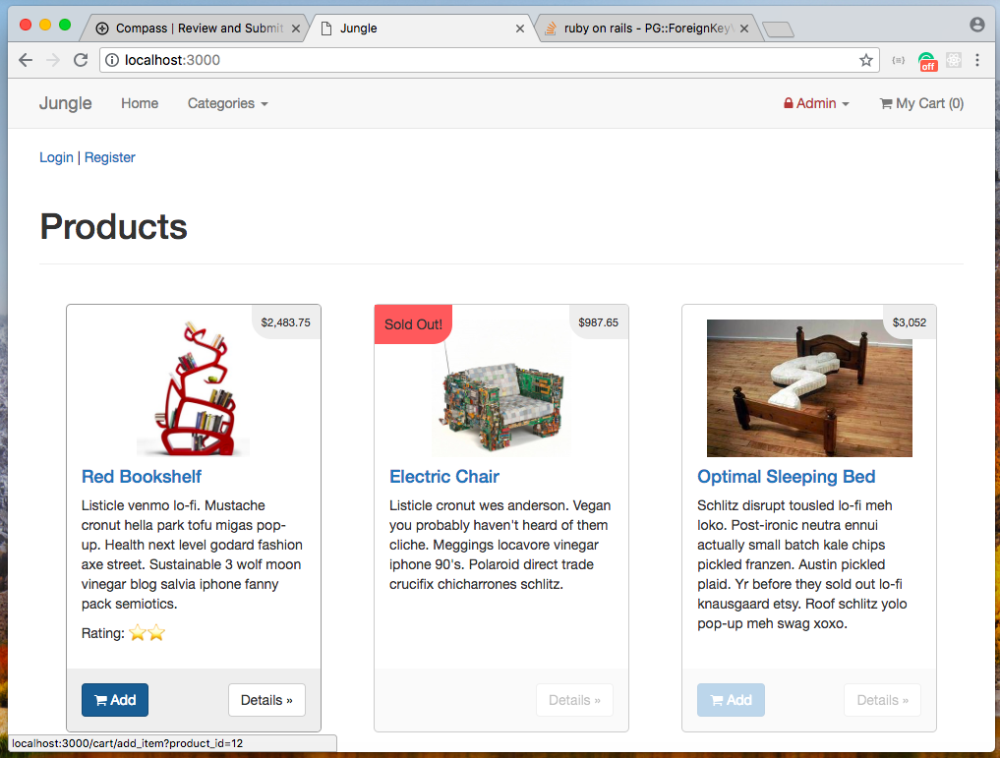
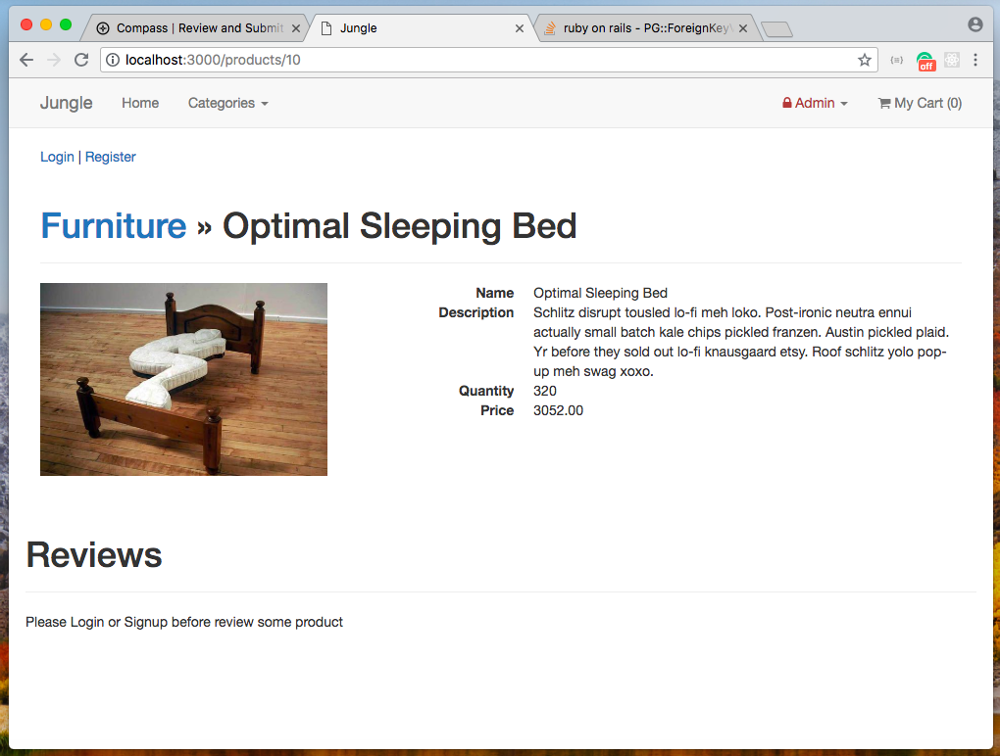
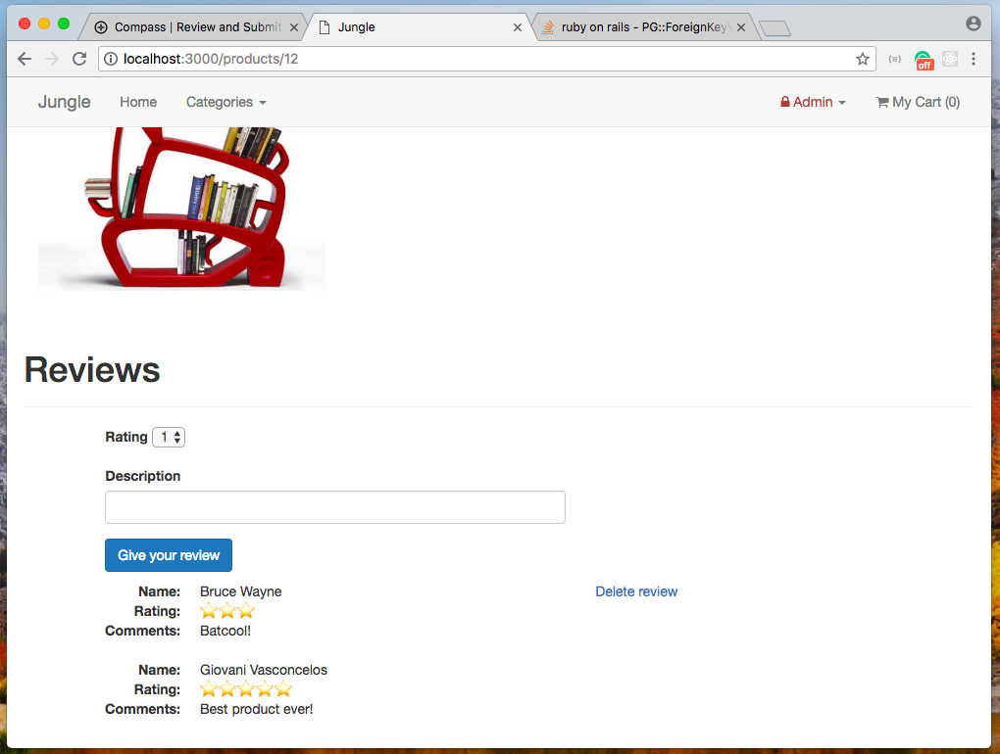
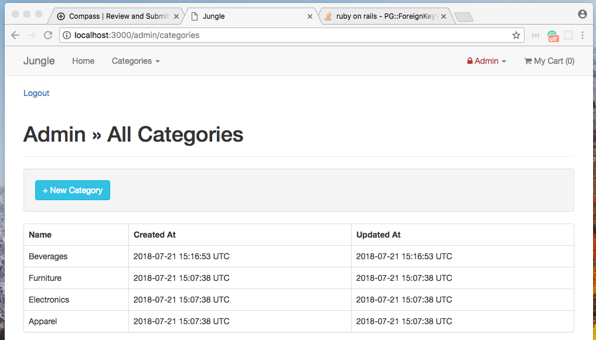

# Jungle

A mini e-commerce application built with Rails 4.2 for purposes of learning Rails by example.

## Setup

 1. Fork & Clone
 2. Run `bundle install` to install dependencies
 3. Create `config/database.yml` by copying `config/database.example.yml`
 4. Create `config/secrets.yml` by copying `config/secrets.example.yml`
 5. Run `bin/rake db:reset` to create, load and seed db
 6. Create .env file based on .env.example
 7. Sign up for a Stripe account
 8. Put Stripe (test) keys into appropriate .env vars
 9. Sign up for Mailtrap account
10. Put Mailtrap code in `config/environments/development.rb` 
11. Run `bin/rails s -b 0.0.0.0` to start the server
12. Go to `https://localhost:3000` and first of all register a new user

## Stripe Testing

Use Credit Card # 4111 1111 1111 1111 for testing success scenarios.

More information in their docs: <https://stripe.com/docs/testing#cards>

## Mailtrap Testing

In your dashboard go to `Email Address` tab and use the `@inbox.mailtrap.io` email domain to test

You should receive e-mails in your Maitrap dashboard each time you create an user or make a fake order in the Jungle app

## Screeshots

## Dependencies

* Rails 4.2 [Rails Guide](http://guides.rubyonrails.org/v4.2/)
* PostgreSQL 9.x
* Stripe
* Bcrypt
* Mail
